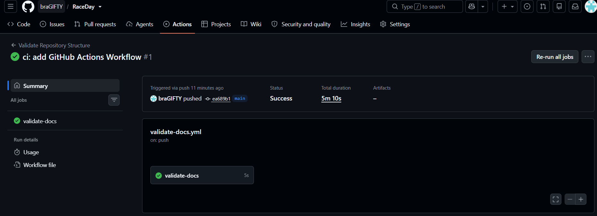

# RaceDay


## Getting Started

To run the database script:
1. Install SQL Server Management Studio (SSMS) with access to a SQL Server instance.
2. Open `docs/raceday-schema.sql` in SSMS and execute it — it creates RaceDayDB, all six tables, and seeds sample data.

Part 2 will additionally require the .NET SDK to build and run the API.
RaceDay is a full-stack event management platform for South Africa's road running, walking, and cycling community. Event Organisers can create and manage events, define categories, and capture participant results. Participants can browse upcoming events, enter them by selecting a category, and track their own enrolment and results history.

This repository currently contains **Part 1: System Planning and Database** — the ERD, the API endpoint plan, and the SQL script that creates and seeds the database, along with the reasoning behind each design decision. No application code is written yet; that begins in Part 2.

## Roles

- **Organiser** — creates, edits, and deletes events; defines categories for each event; captures participant results; and views all enrolments for their own events.
- **Participant** — registers an account, browses events, enters an event by selecting a category, and views their own enrolments and results.

## Repository Structure

```
docs/
├── raceday-erd.png       # Entity Relationship Diagram (Section A)
├── raceday-erd.pdf       # ERD, PDF version
├── endpoint-plan.md      # API Endpoint Plan (Section B)
├── raceday-schema.sql    # SQL database script (Section C)
└── RaceDay System Planning and Database.docx # Full planning document — reasoning + all three sections together
```

## CI/CD

A GitHub Actions workflow (`.github/workflows/validate-docs.yml`) runs on every push to confirm the `/docs` folder exists and contains the required files (ERD, endpoint plan, SQL script).

 

## Video Walkthrough

<!-- TODO: add the unlisted YouTube link once recorded -->
[Part 1 video walkthrough](PASTE_YOUTUBE_LINK_HERE)
